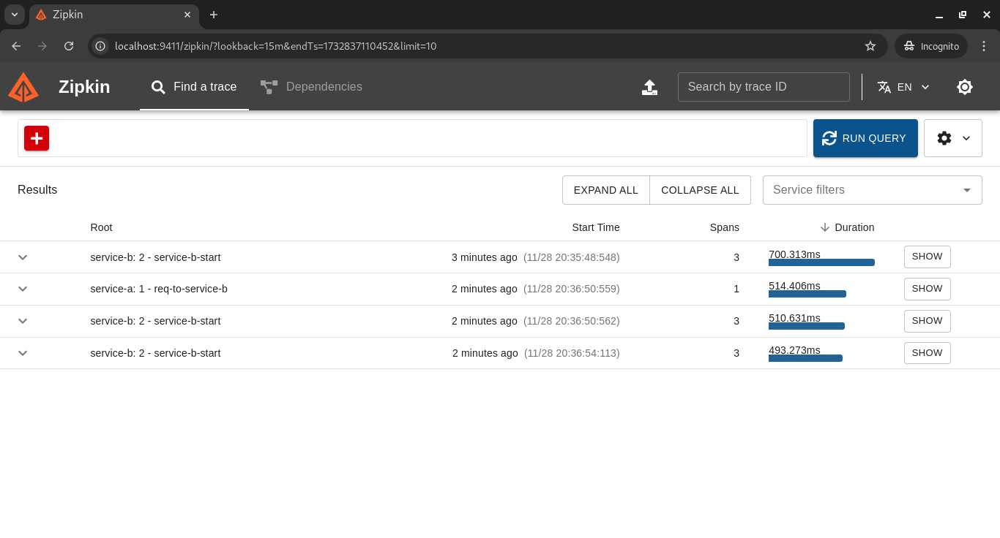
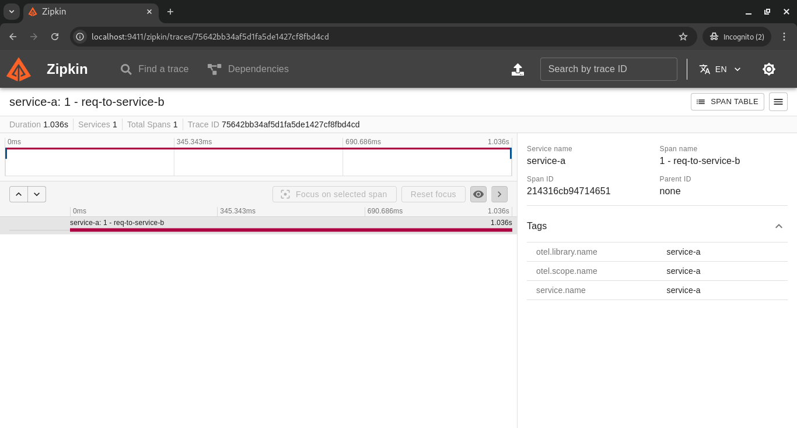
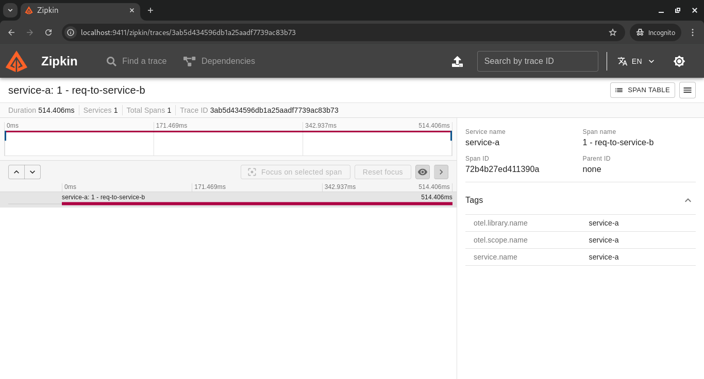
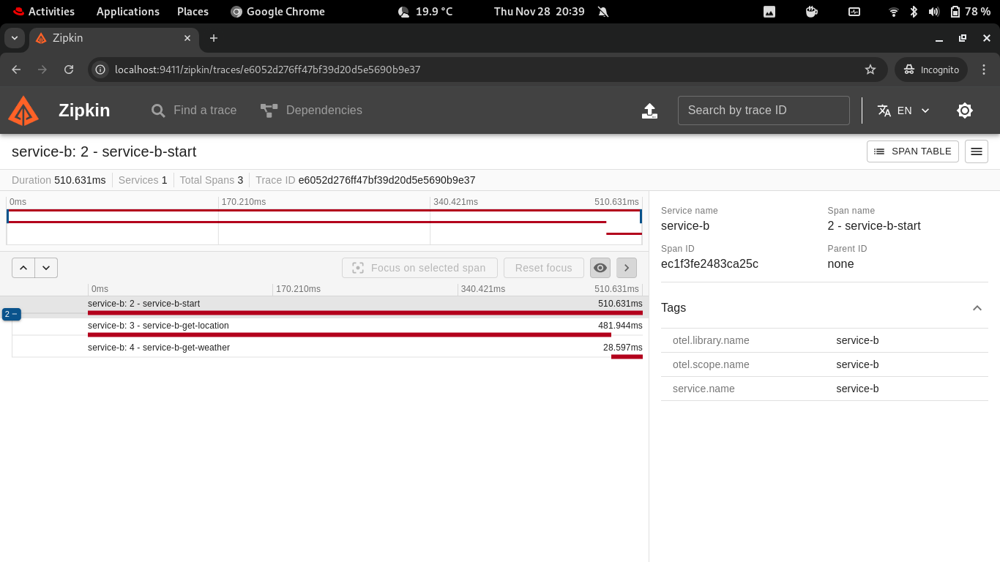
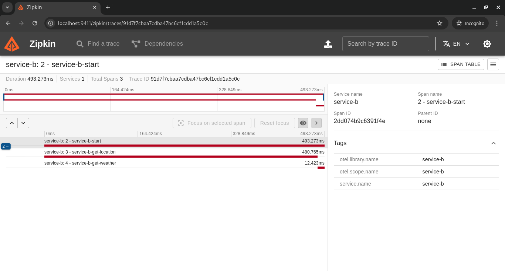

# GoExpert Weather com Tracing 🌦️

Projeto desenvolvido em Go para consulta de clima atual com base em um CEP. O sistema retorna a temperatura em graus Celsius, Fahrenheit e Kelvin. Agora, também inclui **Tracing** para observabilidade, integrando ferramentas como OpenTelemetry e Zipkin. Desenvolvido pelo **Paulo Nunes**.

## Funcionalidades 📋

- Receber um CEP válido de 8 dígitos.
- Consultar a API ViaCEP para identificar a localização do CEP.
- Utilizar a API WeatherAPI para consultar a temperatura na localização encontrada.
- Converter e retornar a temperatura nos formatos Celsius, Fahrenheit e Kelvin.
- Tracing distribuído com OpenTelemetry para facilitar a análise de desempenho.

## Requisitos 📦

- Docker ou Podman e Docker ou Podman Compose instalados.
- Configuração do ambiente com a variável no arquivo **.env**:
  - `WEATHER_API_KEY`: Chave da API WeatherAPI para consulta de clima.

### Para critério de avaliação, mantive o arquivo .env com a minha chave de API privada. Em um cenário real, é necessário utilizar a própria API_KEY. 

## Como executar o projeto 🚀

### Subindo os serviços

1. Utilize o comando a seguir para subir toda a atividade:

```bash
make all
```

2. No seu navegador local, abra a URL e valide as evidências. Abaixo algumas imagens de referência:

http://localhost:9411/


3. Para limpar os recursos, executar:

```bash
make clean
```

### Destruindo os serviços
Para parar e remover os containers criados, use:
```bash
make down
```

### Limpando recursos Docker/Podman
Para remover containers, imagens e volumes não utilizados, execute:
```bash
make clean
```

## Evidências 📷

### Imagem 1: Detalhamento de spans no `service-b`

Esta imagem mostra o trace detalhado do `service-b`, com spans como `service-b-start`, `service-b-get-location` (consulta ao ViaCEP) e `service-b-get-weather` (consulta à API de clima). 

### Imagem 2: Fluxo mais longo do `service-b`

Nesta imagem, temos outro trace do `service-b` com maior duração, destacando novamente os spans internos. O maior tempo foi consumido no `service-b-get-location`.

### Imagem 3: Trace do `service-a` chamando o `service-b`

Esta imagem exibe o trace do `service-a` enquanto realiza uma chamada ao `service-b`, com um único span representando o tempo total de execução.

### Imagem 4: Novo trace do `service-b` com maior duração

Outro trace detalhado do `service-b`, com uma duração ainda maior, devido ao tempo consumido na consulta ao ViaCEP no span `service-b-get-location`.

### Imagem 5: Listagem de traces no Zipkin

Esta imagem apresenta a visão geral de todos os traces registrados no Zipkin, incluindo a duração total de cada trace e os serviços envolvidos.

## Estrutura do Projeto 📂

```
.
├── docker-compose.yaml
├── Makefile
├── README.md
├── service_a
│   ├── Dockerfile
│   ├── go.mod
│   ├── go.sum
│   └── main.go
└── service_b
    ├── Dockerfile
    ├── go.mod
    ├── go.sum
    └── main.go
```

## 👨‍💻 Autor

**Paulo Henrique Nunes Vanderley**  
- 🌐 [Site Pessoal](https://www.paulonunes.dev/)  
- 🌐 [GitHub](https://github.com/paulnune)  
- ✉️ Email: [paulo.nunes@live.de](mailto:paulo.nunes@live.de)  
- 🚀 Aluno da Pós **GoExpert 2024** pela [FullCycle](https://fullcycle.com.br)

---

## 🎉 Agradecimentos

Este repositório foi desenvolvido com muita dedicação para a **Pós GoExpert 2024**. Agradeço à equipe da **FullCycle** por proporcionar uma experiência incrível de aprendizado! 🚀